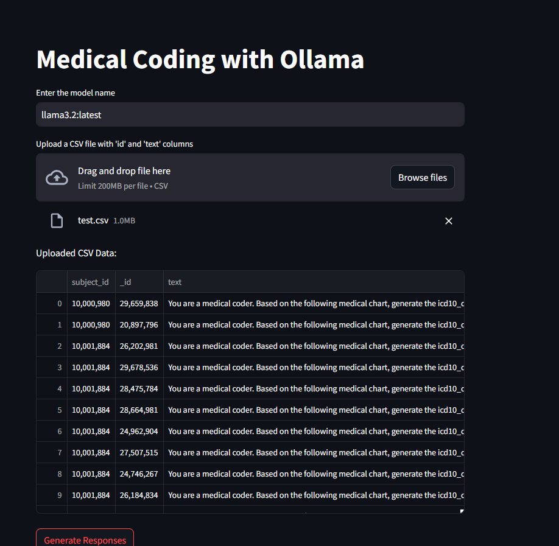
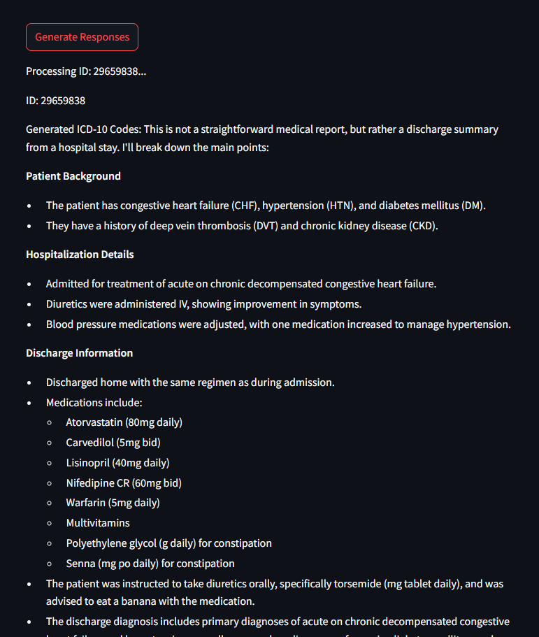

# ICD Code Generator using Ollama and Streamlit on AWS EC2

This project implements an ICD10 (International Classification of Diseases) code generation system using a custom fine-tuned language model through Ollama, deployed on AWS EC2 using Docker and presented via a Streamlit interface.

## Table of Contents
- [System Architecture](#system-architecture)
- [Prerequisites](#prerequisites)
- [Installation](#installation)
- [Docker Setup](#docker-setup)
- [AWS EC2 Configuration](#aws-ec2-configuration)
- [Application Deployment](#application-deployment)
- [Usage](#usage)
- [Troubleshooting](#troubleshooting)
- [Security Considerations](#security-considerations)
- [Contributing](#contributing)
- [License](#license)

## System Architecture

The system consists of several components:
- Custom Fine-tuned Language Model (available at hf.co/vimleshc57/icd10-finetuned-16bit)
- Ollama for model serving
- Docker container for model isolation
- Streamlit web interface
- AWS EC2 instance for hosting
- Network configuration for secure access

## Prerequisites

### Local Development
- Python 3.8+
- Docker Desktop
- Git
- AWS Account
- Basic understanding of terminal/command line

### Model Requirements
- Minimum 8GB RAM
- 20GB free disk space
- CUDA-compatible GPU recommended for faster inference

### Required Python Packages
```bash
streamlit>=1.24.0
ollama>=0.1.0
python-dotenv>=0.19.0
requests>=2.28.0
```

## Installation

1. Clone the repository:
```bash
git clone https://github.com/Vimlesh-17/ICD10-llama3.2.git
cd ICD10-llama3.2
```

2. Install Ollama:
```bash
curl https://ollama.ai/install.sh | sh
```

3. Pull the custom fine-tuned model:
```bash
ollama run hf.co/vimleshc57/icd10-finetuned-16bit
```

4. Create and activate virtual environment:
```bash
python -m venv venv
source venv/bin/activate  # On Windows: .\venv\Scripts\activate
```

5. Install dependencies:
```bash
pip install -r requirements.txt
```

## Docker Setup

1. Create a Dockerfile.model with the custom model:
```dockerfile
FROM ollama/ollama

# Pull the custom model during build
RUN ollama pull hf.co/vimleshc57/icd10-finetuned-16bit

# Set the model as default
ENV DEFAULT_MODEL=hf.co/vimleshc57/icd10-finetuned-16bit

# Expose Ollama port
EXPOSE 11434
```

2. Build the custom model image:
```bash
docker build -t icd-model-image -f Dockerfile.model .
```

3. Build the application image:
```bash
docker build -t icd-app-image -f Dockerfile.app .
```

4. Create a Docker network:
```bash
docker network create icd-network
```

5. Run the containers:
```bash
docker run -d --name model-container --network icd-network icd-model-image
docker run -d --name app-container --network icd-network -p 8501:8501 icd-app-image
```

## AWS EC2 Configuration

1. Launch EC2 Instance:
   - Choose Ubuntu Server 22.04 LTS
   - Recommended: t2.xlarge or better (for model requirements)
   - Storage: Minimum 30GB EBS
   - Configure Security Group:
     ```
     HTTP (80) - Source: 0.0.0.0/0
     HTTPS (443) - Source: 0.0.0.0/0
     Custom TCP (8501) - Source: 0.0.0.0/0
     SSH (22) - Source: Your IP
     ```

2. Connect to EC2:
```bash
chmod 400 your-key-pair.pem
ssh -i your-key-pair.pem ubuntu@your-ec2-ip
```

3. Install Dependencies:
```bash
sudo apt-get update
sudo apt-get install -y docker.io docker-compose
sudo usermod -aG docker ubuntu
```

## Application Deployment

1. Transfer files to EC2:
```bash
scp -i your-key-pair.pem -r ./icd-code-generator ubuntu@your-ec2-ip:~/
```

2. Deploy on EC2:
```bash
cd icd-code-generator
docker-compose up -d
```

3. Configure SSL (Optional but recommended):
```bash
sudo apt-get install certbot
sudo certbot certonly --standalone -d your-domain.com
```

## Usage

1. Access the application:
```
http://your-ec2-ip:8501
```
or if SSL configured:
```
https://your-domain.com
```

2. Using the Interface:
   - Enter medical text in the input field
   - Click "Generate ICD Codes"
   - The custom fine-tuned model will analyze the text and generate relevant ICD10 codes
   - View generated codes and descriptions
   - Export results if needed

### Example Usage and Model Comparison

#### Fine-tuned Model Output
Below is an example of the ICD10 code generation using our fine-tuned model, showing accurate and properly formatted results:


*Figure 1: Custom fine-tuned model generating accurate and properly formatted ICD10 codes*

#### Base Model Comparison
For comparison, here's the output from the base LLaMA 3.2 model, showing incorrect formatting and low accuracy:


*Figure 2: Base LLaMA 3.2 model showing incorrect formatting and low accuracy in ICD10 code generation*

### Key Improvements in Fine-tuned Model
- Proper formatting of ICD10 codes
- Higher accuracy in code assignment
- Better understanding of medical terminology
- Structured output format
- Relevant code descriptions

## Model Information

### Custom Fine-tuned Model Details
- Model Name: ICD10 Fine-tuned Model
- Location: hf.co/vimleshc57/icd10-finetuned-16bit
- Base Architecture: LLaMA
- Fine-tuning Dataset: ICD10 medical coding dataset
- Quantization: 16-bit for optimal performance/memory trade-off
- Supported Tasks: Medical text analysis and ICD10 code generation

### Model Performance
- Optimized for medical terminology
- Enhanced accuracy for ICD10 code generation
- Reduced hallucination for medical contexts
- Fast inference times with 16-bit quantization

## Troubleshooting

### Common Issues and Solutions

1. Docker Container Issues:
```bash
# Check container logs
docker logs app-container
docker logs model-container

# Restart containers
docker-compose restart
```

2. Model Loading Issues:
```bash
# Verify model files
docker exec -it model-container ls /app/model

# Check Ollama logs
docker exec -it model-container cat /var/log/ollama.log
```

3. Network Issues:
```bash
# Test network connectivity
docker network inspect icd-network

# Verify ports
netstat -tulpn | grep LISTEN
```

Additional Model-Specific Troubleshooting:
```bash
# Verify model installation
ollama list

# Check model status
ollama show hf.co/vimleshc57/icd10-finetuned-16bit

# Test model directly
ollama run hf.co/vimleshc57/icd10-finetuned-16bit "Test prompt"
```

## Security Considerations

1. AWS Security:
   - Use IAM roles with minimal permissions
   - Keep security groups restricted
   - Regularly update security patches

2. Application Security:
   - Implement rate limiting
   - Use HTTPS
   - Sanitize user inputs
   - Regular security audits

3. Data Protection:
   - Encrypt sensitive data
   - Regular backups
   - Comply with healthcare data regulations

## Contributing

1. Fork the repository
2. Create feature branch
3. Commit changes
4. Push to branch
5. Create Pull Request

## License

This project is licensed under the MIT License - see the LICENSE file for details.

---

## Contact

For support or queries, please contact:
- Email: vimleshc7317@gmail.com
- Model Repository: https://huggingface.co/vimleshc57/icd10-finetuned-16bit
- Issue Tracker: GitHub Issues

## Acknowledgments

- Ollama team for the model serving framework
- Streamlit team for the web interface framework
- AWS for cloud infrastructure
```
